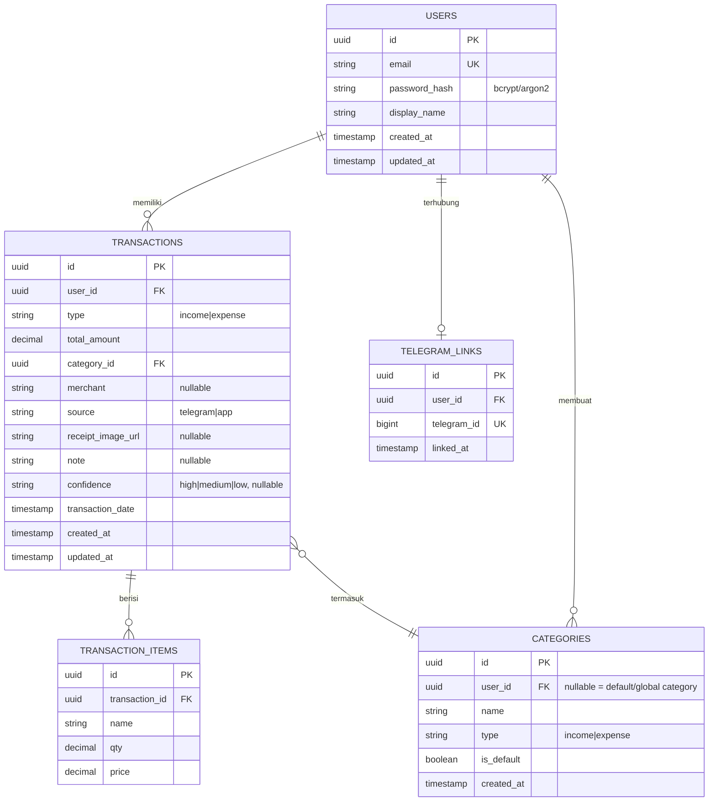

# ARCHITECTURE.md — MyMoney

## 1. Ringkasan Sistem

MyMoney adalah aplikasi pencatatan keuangan pribadi dengan input multi-kanal (Telegram bot & Android app), parsing transaksi otomatis berbasis LLM (teks & foto nota), serta fitur pelaporan. Backend berjalan self-hosted di VPS.

**Prinsip arsitektur inti:**
- **Single source of truth**: seluruh logic bisnis (buat transaksi, validasi, report) hidup di satu service layer backend. Telegram bot dan Android app adalah *thin client* yang memanggil API/service yang sama — tidak ada logic duplikat di masing-masing kanal.
- **Model routing berdasarkan kapabilitas**: setiap task diarahkan ke model yang tepat sesuai kekuatannya (teks vs vision), bukan satu model untuk semua.
- **Extensible tanpa overengineering**: skema data isolated per-user di v1, tapi tidak menutup jalan ke fitur shared/household di masa depan.

## 2. Diagram Arsitektur Tingkat Tinggi
┌──────────────┐ ┌───────────────┐
│ Telegram │ │ Android App │
│ (teks/foto) │ │ (teks/foto) │
└───────┬───────┘ └───────┬────────┘
│ Webhook (HTTPS) │ REST API (JWT)
└───────────┬─────────────┘
│
┌────────▼─────────┐
│ Cloudflare │
│ Tunnel │
└────────┬─────────┘
│
┌────────────▼─────────────┐
│ FastAPI Backend │
│ (Docker) │
│ ┌──────────────────────┐ │
│ │ API Layer │ │
│ │ - telegram_webhook │ │
│ │ - transactions (REST)│ │
│ │ - auth │ │
│ │ - reports │ │
│ └──────────┬───────────┘ │
│ │ │
│ ┌──────────▼───────────┐ │
│ │ Service Layer │ │
│ │ - transaction_service │ │
│ │ - nlu_parser │ │
│ │ - receipt_parser │ │
│ │ - report_service │ │
│ │ - auth_service │ │
│ └──────────┬───────────┘ │
└─────────────┼─────────────┘
│
┌──────────────┼───────────────┐
│ │ │
┌───────▼──────┐ ┌─────▼──────┐ ┌──────▼───────┐
│ PostgreSQL │ │ GLM 5.2 │ │ Gemini 3.5 │
│ (Docker) │ │ (teks) │ │ Flash-Lite │
│ │ │ │ │ (vision/OCR) │
└───────────────┘ └─────────────┘ └───────────────┘

## 3. Komponen Sistem

### 3.1 Backend (FastAPI, Docker, 24/7)
Satu backend tunggal menangani seluruh logic. Struktur monorepo (lihat §7).

| Layer | Tanggung Jawab |
|---|---|
| API Layer | Terima request dari Telegram webhook & Android REST client, validasi input dasar, auth |
| Service Layer | Logic bisnis: buat/edit/hapus transaksi, parsing (teks & gambar), generate report |
| Data Layer | SQLAlchemy models + Alembic migration ke PostgreSQL |
| Logging | Log aplikasi terstruktur (JSON) ke stdout via `structlog`, ditangkap Docker dengan log rotation |
| Audit Service | `audit_service.py` — mencatat aksi sensitif (create/edit/delete transaksi, login) ke tabel `audit_logs`, dipanggil dari service layer terkait |
| Layer | Tanggung Jawab |
|---|---|
| Account Service | `account_service.py` — CRUD akun, hitung saldo (computed), alur hapus dengan reassignment transaksi |

**Aturan ketat**: `telegram_webhook.py` dan `transactions.py` (REST) **hanya** boleh memanggil fungsi dari service layer (`transaction_service`, dst). Tidak boleh ada logic bisnis ditulis langsung di API layer.

### 3.2 Telegram Bot
- Terhubung via webhook ke endpoint `/webhook/telegram`.
- Menerima teks (`"beli kangkung 5k"`) dan foto nota.
- `telegram_user_id` di-mapping ke `user_id` internal saat `/start` pertama kali (auto-register/link akun).
- Command pendukung: `/report`, `/undo <id>`, `/edit <id>`.

### 3.3 Android App
- Kotlin + Jetpack Compose, konsumsi REST API yang sama dengan yang dipakai internal untuk Telegram.
- Autentikasi JWT (access token + refresh token).
- Fitur: input manual, foto nota (CameraX), lihat & edit transaksi, dashboard report (Vico/MPAndroidChart).

### 3.4 LLM Services — OpenRouter sebagai Single Gateway

Semua model LLM diakses via **OpenRouter** (satu API key, satu client),
bukan direct API call terpisah per provider.

| Task | Model Primary | Fallback |
|---|---|---|
| Text parsing ("beli kangkung 5k") | `z-ai/glm-5.2:free` | `meta-llama/llama-3.3-70b-instruct:free` |
| Vision/OCR (foto nota) | `google/gemma-4-31b-it:free` | `thinkingmachines/inkling:free` |
| Last resort (semua gagal) | `openrouter/free` (OpenRouter pilih otomatis) | — |

**Catatan model free OpenRouter**: daftar model gratis berubah konstan
(beberapa model sudah dihapus dalam minggu-minggu terakhir).
Pantau `openrouter.ai/collections/free-models` secara berkala —
kalau model primary dihapus, ganti ke model berikutnya di fallback list.
Kalau volume request melebihi rate limit gratis (biasanya ~20 req/menit),
pertimbangkan upgrade ke model berbayar murah via OpenRouter yang sama
tanpa perubahan arsitektur.

## 4. Alur Data Utama

### 4.1 Input Teks (Telegram/App)
User kirim teks → API layer → transaction_service.create_transaction(raw_text)
→ nlu_parser.parse(raw_text) via GLM 5.2 → JSON {type, amount, category, note}
→ validate() → langsung commit ke PostgreSQL (Direct Save)
→ kirim balasan sukses ke Telegram

### 4.2 Input Foto Nota (Telegram/App)
User kirim foto → API layer → receipt_service.parse_receipt_image(image)
→ Gemini 3.5 Flash-Lite (vision) → JSON {merchant, date, total, items[], confidence}
→ validate() → jika confidence low, tandai perlu review manual
→ [Telegram] langsung commit ke DB | [App] pre-fill form editable → user simpan
→ commit transaction + transaction_items ke PostgreSQL
→ simpan file gambar nota (local storage, path disimpan di receipt_image_url)

### 4.3 Report
User request /report atau buka dashboard app
→ report_service.get_report(user_id, period)
→ query PostgreSQL (agregasi per kategori/waktu)
→ return data terstruktur → render chart (app) / teks+gambar (Telegram)

### 4.4 Nonaktifkan  Akun
User nonaktifkan akun → account_service.deactivate_account(source_id, target_id)
  → hitung saldo tersisa akun source (query computed balance)
  → jika saldo != 0: buat transaksi penyeimbang (expense di source, income di target)
  → set is_active = FALSE pada akun source
  → catat ke audit_logs

## 5. Entity Relationship Diagram (ERD)



**Catatan desain skema:**
- `user_id` dipakai konsisten sebagai foreign key isolasi data di v1. Untuk ekstensi shared/household di masa depan, tabel `HOUSEHOLDS` dan `HOUSEHOLD_MEMBERS` bisa ditambahkan tanpa mengubah struktur `TRANSACTIONS` — cukup tambah kolom `household_id` nullable belakangan.
- `CATEGORIES` mendukung kategori default (global, `user_id` null) dan kategori custom per-user, sesuai keputusan "fixed list tapi bisa ditambah/edit".
- `TRANSACTION_ITEMS` terpisah dari `TRANSACTIONS` (bukan JSON blob) agar query agregasi per-item (misal total belanja per kategori barang) tetap efisien.
- Detail lengkap kolom, tipe data, index, dan constraint dibahas di `DATABASE.md`.

## 6. Keamanan

| Aspek | Pendekatan |
|---|---|
| Password user | **Bcrypt/Argon2** hashing — tidak pernah disimpan plaintext, tidak reversible |
| Autentikasi API | **JWT** (access token umur pendek + refresh token umur panjang), stateless |
| Secrets (API key LLM, DB credential) | Disimpan di **.env** (dev) / **vault** (opsional untuk produksi), tidak pernah di-commit ke repo (karena repo publik) |
| Transport | HTTPS via Cloudflare Tunnel — tidak ada trafik plaintext ke server |
| Validasi input | Semua output LLM divalidasi (tipe data, range nilai) sebelum masuk service layer/database |
| `.gitignore` | Wajib exclude `.env`, credential file, dan folder `receipts/` (gambar nota) dari repo publik |
| `OPENROUTER_API_KEY` | disimpan di `.env`, tidak pernah di-commit. Ganti `Z_AI_API_KEY` dan `GEMINI_API_KEY` yang sebelumnya terpisah menjadi satu key ini |

**Penting karena repo public**: dokumentasi (README, .md files) tidak boleh mencantumkan API key, domain Cloudflare Tunnel asli, atau kredensial apa pun — semua contoh di dokumentasi harus pakai placeholder.

## 7. Struktur Repository (Monorepo)
mymoney/
├── backend/
│ ├── app/
│ │ ├── main.py
│ │ ├── api/
│ │ │ ├── telegram_webhook.py
│ │ │ ├── transactions.py
│ │ │ ├── receipts.py
│ │ │ ├── auth.py
│ │ │ └── reports.py
│ │ ├── core/
│ │ │ ├── transaction_service.py
│ │ │ ├── receipt_service.py
│ │ │ ├── nlu_parser.py
│ │ │ ├── report_service.py
│ │ │ └── auth_service.py
│ │ ├── models/
│ │ ├── schemas/
│ │ └── db/
│ ├── alembic/
│ ├── tests/
│ ├── Dockerfile
│ └── requirements.txt
├── android/
│ └── (project Kotlin/Compose standar)
├── docs/
│ ├── ARCHITECTURE.md
│ ├── REQUIREMENTS.md
│ ├── DATABASE.md
│ ├── CODING_RULES.md
│ └── ROADMAP.md
├── docker-compose.yml
├── .env.example
├── .gitignore
└── README.md


## 8. Deployment

- **Host**: laptop pribadi, nyala 24/7.
- **Orkestrasi**: Docker Compose (FastAPI + PostgreSQL + reverse proxy jika perlu).
- **Exposure ke internet**: Cloudflare Tunnel — domain tetap, tanpa buka port router.
- **Resilience minimum**: `restart: unless-stopped` di semua service Docker Compose, agar otomatis recover setelah restart laptop/update sistem.
- **CI/CD**: GitHub Actions — lint (ruff/black) + test otomatis pada setiap push/PR ke branch utama (detail di `CODING_RULES.md`).

## 9. Batasan & Keputusan Sadar (Out of Scope v1)

- Tidak ada multi-currency (IDR saja).
- Tidak ada shared/household data (isolated per-user, tapi skema extensible).
- Tidak ada enkripsi at-rest untuk data transaksi (hanya password yang di-hash) — keputusan sadar berdasarkan trade-off kompleksitas vs kebutuhan compliance yang belum ada.
- Tidak menggunakan agent framework/orchestration tool pihak ketiga (n8n, Hermes Agent) — seluruh logic ditulis eksplisit di backend untuk kontrol penuh dan nilai portfolio.
- **Tidak ada aplikasi iOS di v1.** Backend didesain client-agnostic (REST API murni) sehingga penambahan client iOS di masa depan tidak memerlukan perubahan arsitektur, database, atau service layer — hanya penambahan client native baru (Swift/SwiftUI) yang mengonsumsi API yang sama. Dicatat sebagai kandidat fase v2 di `ROADMAP.md`, bukan bagian dari scope v1.

## 10. Security Architecture

### Threat Model (Relevan untuk MyMoney)

| Ancaman | Permukaan Serangan | Mitigasi |
|---|---|---|
| SQL Injection | Semua query database | ORM SQLAlchemy + parameterized query wajib |
| Prompt Injection | Input teks/foto ke LLM | System prompt hardcoded + validasi output Pydantic + panjang input dibatasi |
| CSRF | Endpoint state-changing | JWT di header (bukan cookie) + validasi webhook secret Telegram |
| XSS | Response API + WebView Android | Escape output + sanitasi input + WebView JS disabled |
| Credential Theft | JWT token + API key | Short-lived access token (15 menit) + refresh token hashed di DB |
| Brute Force | Login endpoint | Rate limiting 5 req/menit per IP |
| File Upload Attack | Endpoint foto nota | Validasi magic bytes + ukuran max 10MB + simpan di luar webroot |
| Container Escape | Docker | Non-root user + read-only filesystem + drop all capabilities |
| Dependency CVE | Python packages | pip-audit di CI/CD pipeline |
| Secrets Exposure | .env, API keys | chmod 600 + tidak pernah di-log + rotasi berkala |

### Security Layer 

```mermaid
Internet
│
▼
Cloudflare (DDoS protection) ← opsional, direkomendasikan
│
▼
Nginx (rate limiting awal, SSL termination, max body size)
│
▼
FastAPI Middleware Layer
├── JWT validation (semua endpoint kecuali /auth/login, /auth/register)
├── Telegram webhook secret validation (/webhook/telegram)
├── Rate limiter (slowapi)
└── Request size validation
│
▼
API Layer (validasi Pydantic schema)
│
▼
Service Layer (business rule validation)
│
▼
Database Layer (constraint: CHECK, NOT NULL, FK)
```
Defense in depth: setiap lapisan memvalidasi ulang secara independen —
kegagalan di satu lapisan tidak langsung membuka akses ke sistem.