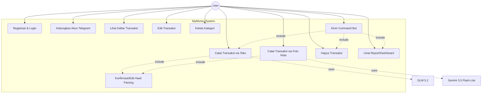

# REQUIREMENTS.md — MyMoney

## 1. Ringkasan

Dokumen ini mendefinisikan kebutuhan fungsional dan non-fungsional untuk MyMoney v1: aplikasi pencatatan keuangan pribadi dengan input via Telegram bot dan Android app, parsing otomatis berbasis LLM (teks & foto nota), serta fitur pelaporan.

## 2. Aktor

| Aktor | Deskripsi |
|---|---|
| **User** | Terdaftar via Supabase Auth (email/password, magic link, atau OAuth Google/Apple), berinteraksi lewat Telegram bot dan/atau Flutter app (Android/iOS/Web) |
| **Telegram Bot System** | Node.js + Telegraf, meneruskan pesan ke backend API (BUKAN akses Supabase langsung) |
| **Deepseek V4 Flash** | Sistem eksternal, parsing teks jadi transaksi terstruktur |
| **Deepseek V4 Flash Vision Model Exp** | Sistem eksternal, parsing foto nota jadi transaksi terstruktur |

## 3. Use Case Diagram

## 4. Functional Requirements (User Stories)

## 4.1 Autentikasi & Akun (REVISI)

**US-01 (REVISI)** — Sebagai user baru, saya ingin registrasi via email/
password ATAU magic link ATAU OAuth Google, agar saya bisa pilih metode
yang paling nyaman tanpa sistem auth custom yang rawan bug.
- Ditangani penuh oleh Supabase Auth — password hashing, email verification
  bawaan, TIDAK PERLU implementasi custom.

**US-02 (REVISI)** — Sebagai user, saya ingin login dan session saya
dikelola otomatis (refresh token otomatis oleh Supabase SDK), agar saya
tidak perlu login ulang setiap token kadaluarsa.

**US-03** — Sebagai user, saya ingin menghubungkan akun Telegram saya ke akun MyMoney lewat command `/start`, agar bot mengenali saya tanpa login ulang tiap chat.

### 4.2 Pencatatan Transaksi — Teks

**US-04** — Sebagai user, saya ingin mengetik pesan bebas seperti "beli kangkung 5k" di Telegram, agar sistem otomatis mendeteksi jenis transaksi (pemasukan/pengeluaran), nominal, dan kategori.
- Sistem memanggil GLM 5.2 untuk parsing.
- Output divalidasi (nominal harus angka positif, tipe harus valid) sebelum ditampilkan ke user.

**US-05** — Sebagai user, saya ingin melihat hasil parsing sebelum tersimpan permanen, agar saya bisa koreksi kalau sistem salah membaca.

**US-06** — Sebagai user, saya ingin mencatat transaksi lewat input form manual di Android app (tanpa LLM), sebagai alternatif kalau saya tidak ingin ketik natural language.

### 4.3 Pencatatan Transaksi — Foto Nota (OCR)

**US-07 (REVISI)** — Sebagai user, saya ingin memfoto nota belanja lewat Telegram atau Android app, agar sistem otomatis mengekstrak merchant, tanggal, total, dan rincian per item. Gambar nota disimpan di Supabase Storage (bucket privat), diakses via signed URL berumur pendek dari Flutter app, bukan local storage VPS.
- Sistem memanggil Gemini 3.5 Flash-Lite untuk vision parsing.
- Hasil mencakup level `confidence` (high/medium/low).

**US-08** — Sebagai user, saya ingin mengedit rincian per item hasil OCR (nama, qty, harga) sebelum disimpan, karena OCR bisa salah baca terutama nota buram/tulisan tangan.

**US-09** — Sebagai user, saya ingin sistem menandai secara jelas kalau hasil OCR confidence-nya rendah, agar saya tahu perlu cek ulang manual, bukan langsung percaya begitu saja.

**US-10** — Sebagai user, saya ingin gambar nota asli tetap tersimpan setelah parsing, agar saya bisa lihat bukti aslinya kapan saja.

### 4.4 Manajemen Transaksi

**US-11** — Sebagai user, saya ingin melihat daftar transaksi saya (filter by tanggal/kategori/tipe), baik lewat app maupun command `/report` di Telegram.

**US-12** — Sebagai user, saya ingin mengedit transaksi yang sudah tersimpan, kalau ternyata ada kesalahan yang baru saya sadari belakangan.

**US-13** — Sebagai user, saya ingin menghapus transaksi yang salah/duplikat lewat command `/undo <id>` di Telegram atau swipe-delete di app.

### 4.5 Kategori

**US-14** — Sebagai user, saya ingin sistem menyediakan kategori default (Makanan, Transport, dll), agar saya tidak perlu setup dari nol.

**US-15** — Sebagai user, saya ingin menambah/mengedit kategori custom lewat Android app, agar bisa menyesuaikan dengan kebiasaan belanja saya.

### 4.6 Report

**US-16** — Sebagai user, saya ingin melihat ringkasan pengeluaran/pemasukan per periode (harian/mingguan/bulanan) dalam bentuk grafik di Android app.

**US-17** — Sebagai user, saya ingin meminta ringkasan singkat lewat command `/report` di Telegram, agar bisa cek cepat tanpa buka app.

**US-18** — Sebagai user, saya ingin menambahkan akun bank/dompet tunai secara manual (nama akun, nama bank, saldo awal), agar sistem tahu sumber dana transaksi saya.

**US-19** — Sebagai user, saya ingin melihat saldo tiap akun terhitung otomatis (saldo awal + akumulasi transaksi), tanpa perlu update manual tiap kali bertransaksi.

**US-20** — Sebagai user, saya ingin sistem mendeteksi akun dari teks chat Telegram saya (misal "...dari BCA"), dan otomatis pakai akun default kalau tidak disebutkan.

**US-21** — Sebagai user, saya ingin memilih akun lewat UI (dropdown) saat input manual di Android app.

**US-22** — Sebagai user, saya ingin menonaktifkan akun yang sudah tidak dipakai (bukan menghapus permanen); jika masih ada saldo tersisa, sistem meminta saya pilih akun tujuan dan otomatis membuat transaksi penyeimbang agar saldo tersisa berpindah tanpa mengubah riwayat transaksi lama.

## 5. Non-Functional Requirements (REVISI)

| Kategori | Requirement (REVISI) |
|---|---|
| **Keamanan** | Password dikelola Supabase Auth (tidak pernah Anda pegang hash-nya); RLS aktif di semua tabel data user sebagai lapis kedua; service_role key hanya di backend, tidak pernah di client |
| **Portability** | Flutter app: satu codebase untuk Android/iOS/Web — REST API backend tetap client-agnostic |
| **Cost control** | REVISI: tambah pertimbangan biaya platform (Supabase/Railway/Render free tier limit), bukan hanya biaya model LLM |

## 6. Out of Scope (v1) — REVISI

- Multi-currency — TIDAK BERUBAH.
- Shared/household data — TIDAK BERUBAH.
- ~~Aplikasi iOS~~ **DIHAPUS dari Out of Scope** — otomatis in-scope via Flutter.
- Publikasi resmi ke Play Store/App Store — **DITAMBAHKAN sebagai Out of
  Scope v1** (build APK/testing manual cukup untuk v1, publikasi store
  adalah effort terpisah: developer account, review process, dsb).
- Integrasi agent framework pihak ketiga — TIDAK BERUBAH.