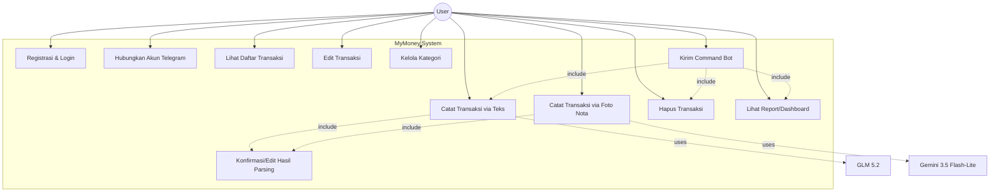

# REQUIREMENTS.md — MyMoney

## 1. Ringkasan

Dokumen ini mendefinisikan kebutuhan fungsional dan non-fungsional untuk MyMoney v1: aplikasi pencatatan keuangan pribadi dengan input via Telegram bot dan Android app, parsing otomatis berbasis LLM (teks & foto nota), serta fitur pelaporan.

## 2. Aktor

| Aktor | Deskripsi |
|---|---|
| **User** | Pengguna terdaftar, berinteraksi lewat Telegram bot dan/atau Android app |
| **Telegram Bot System** | Antarmuka pasif yang meneruskan pesan/foto user ke backend |
| **GLM 5.2** | Sistem eksternal, parsing teks jadi transaksi terstruktur |
| **Gemini 3.5 Flash-Lite** | Sistem eksternal, parsing foto nota jadi transaksi terstruktur |

## 3. Use Case Diagram

## 4. Functional Requirements (User Stories)

### 4.1 Autentikasi & Akun

**US-01** — Sebagai user baru, saya ingin registrasi dengan email & password, agar data keuangan saya terisolasi dan aman.
- Password di-hash (argon2), tidak pernah disimpan plaintext.
- Validasi email unik.

**US-02** — Sebagai user, saya ingin login dan mendapat access token + refresh token (JWT), agar bisa akses API dari Android app secara aman.

**US-03** — Sebagai user, saya ingin menghubungkan akun Telegram saya ke akun MyMoney lewat command `/start`, agar bot mengenali saya tanpa login ulang tiap chat.

### 4.2 Pencatatan Transaksi — Teks

**US-04** — Sebagai user, saya ingin mengetik pesan bebas seperti "beli kangkung 5k" di Telegram, agar sistem otomatis mendeteksi jenis transaksi (pemasukan/pengeluaran), nominal, dan kategori.
- Sistem memanggil GLM 5.2 untuk parsing.
- Output divalidasi (nominal harus angka positif, tipe harus valid) sebelum ditampilkan ke user.

**US-05** — Sebagai user, saya ingin melihat hasil parsing sebelum tersimpan permanen, agar saya bisa koreksi kalau sistem salah membaca.

**US-06** — Sebagai user, saya ingin mencatat transaksi lewat input form manual di Android app (tanpa LLM), sebagai alternatif kalau saya tidak ingin ketik natural language.

### 4.3 Pencatatan Transaksi — Foto Nota (OCR)

**US-07** — Sebagai user, saya ingin memfoto nota belanja lewat Telegram atau Android app, agar sistem otomatis mengekstrak merchant, tanggal, total, dan rincian per item.
- Sistem memanggil Gemini 3.5 Flash-Lite untuk vision parsing.
- Hasil mencakup level `confidence` (high/medium/low).

**US-08** — Sebagai user, saya ingin mengedit rincian per item hasil OCR (nama, qty, harga) sebelum disimpan, karena OCR bisa salah baca terutama nota buram/tulisan tangan.

**US-09** — Sebagai user, saya ingin sistem menandai secara jelas kalau hasil OCR confidence-nya rendah, agar saya tahu perlu cek ulang manual, bukan langsung percaya begitu saja.

**US-10** — Sebagai user, saya ingin gambar nota asli tetap tersimpan setelah parsing, agar saya bisa lihat bukti aslinya kapan saja.

### 4.4 Manajemen Transaksi

**US-11** — Sebagai user, saya ingin melihat daftar transaksi saya (filter by tanggal/kategori/tipe), baik lewat app maupun command `/report` di Telegram.

**US-12** — Sebagai user, saya ingin mengedit transaksi yang sudah tersimpan, kalau ternyata ada kesalahan yang baru saya sadari belakangan.

**US-13** — Sebagai user, saya ingin menghapus transaksi yang salah/duplikat lewat command `/batal <id>` di Telegram atau swipe-delete di app.

### 4.5 Kategori

**US-14** — Sebagai user, saya ingin sistem menyediakan kategori default (Makanan, Transport, dll), agar saya tidak perlu setup dari nol.

**US-15** — Sebagai user, saya ingin menambah/mengedit kategori custom lewat Android app, agar bisa menyesuaikan dengan kebiasaan belanja saya.

### 4.6 Report

**US-16** — Sebagai user, saya ingin melihat ringkasan pengeluaran/pemasukan per periode (harian/mingguan/bulanan) dalam bentuk grafik di Android app.

**US-17** — Sebagai user, saya ingin meminta ringkasan singkat lewat command `/report` di Telegram, agar bisa cek cepat tanpa buka app.

**US-18** — Sebagai user, saya ingin menambahkan akun bank/dompet tunai secara manual (nama akun, nama bank, saldo awal), agar sistem tahu sumber dana transaksi saya.

**US-19** — Sebagai user, saya ingin melihat saldo tiap akun terhitung otomatis (saldo awal + akumulasi transaksi), tanpa perlu update manual tiap kali bertransaksi.

**US-20** — Sebagai user, saya ingin sistem mendeteksi akun dari teks chat Telegram saya (misal "...dari BCA"), dan otomatis pakai akun default kalau tidak disebutkan.

**US-21** — Sebagai user, saya ingin memilih akun lewat UI (dropdown) saat input manual di Android app.

**US-22** — Sebagai user, saya ingin menonaktifkan akun yang sudah tidak dipakai (bukan menghapus permanen); jika masih ada saldo tersisa, sistem meminta saya pilih akun tujuan dan otomatis membuat transaksi penyeimbang agar saldo tersisa berpindah tanpa mengubah riwayat transaksi lama.

## 5. Non-Functional Requirements

| Kategori | Requirement |
|---|---|
| **Keamanan** | Password di-hash (argon2); JWT untuk auth API; secrets (API key, DB credential) tidak pernah di-commit ke repo publik, disimpan di `.env`/vault |
| **Availability** | Backend target uptime tinggi selama laptop menyala 24/7; auto-restart container (`restart: unless-stopped`) jika crash |
| **Performance** | Response parsing teks (GLM 5.2) dan foto (Gemini 3.5 Flash-Lite) idealnya < 5 detik agar tidak terasa lambat di chat |
| **Data integrity** | Semua output LLM divalidasi sebelum commit ke database; tidak ada auto-commit tanpa konfirmasi user |
| **Portability** | Backend REST API bersifat client-agnostic, agar bisa diperluas ke client baru (misal iOS di v2) tanpa perubahan arsitektur |
| **Maintainability** | Kode mengikuti konvensi di `CODING_RULES.md`; CI/CD (GitHub Actions) menjalankan lint & test otomatis di setiap push |
| **Auditability** | Kolom `source` (telegram/app) dicatat di tiap transaksi untuk keperluan audit asal data |
| **Cost control** | Model routing dipilih berdasarkan biaya (GLM 5.2 & Gemini 3.5 Flash-Lite dipilih karena murah untuk volume personal, bukan model flagship mahal) |
| **Auditability** | Setiap aksi create/edit/delete transaksi dan login tercatat permanen di `audit_logs` (siapa, apa, kapan, dari kanal mana), terpisah dari log aplikasi operasional |
| **Data integrity** | Transaksi tidak boleh menjadi orphan (`account_id` tanpa akun valid) — penghapusan akun dengan riwayat transaksi wajib melalui alur reassignment atomik |

## 6. Out of Scope (v1)

- Multi-currency (hanya IDR).
- Shared/household data antar user (isolated per-user; extensible untuk masa depan).
- Enkripsi at-rest untuk data transaksi (hanya password yang di-hash).
- Aplikasi iOS (dicatat sebagai kandidat v2 di `ROADMAP.md`).
- Integrasi agent framework/orchestration pihak ketiga (n8n, Hermes Agent).